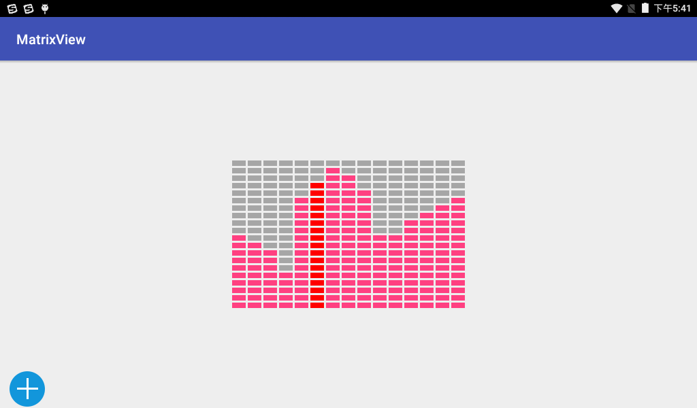

# MatrixView

[](https://bintray.com/hbshen/maven/MatrixView)
[](http://osxdy7if8.bkt.clouddn.com/MatrixView-example-release.apk)

MatrixView is a matrix chart, similar to a histogram, is used to display data chart, it also supports editing function, draw the trajectory of fingers on the diagram according to the corresponding data path generation, chart display will show the animation for the first time, support a particular column highlighted or flash animation.

## Preview



## Using MatrixView in your application
### ADT	
	No more support

### Gradle ​ 
Add dependencies in build.gradle of your module:  

	dependencies {
		compile 'com.ayst.matrixview:matrixview:1.0'
	}

## Usage
### Simple Example
```
public class MainActivity extends AppCompatActivity {

    private MatrixView mMatrixView;
    private int[] mExampleData = {10, 9, 8, 5, 15, 17, 19, 18, 16, 10, 10, 12, 13, 14, 15};

    @Override
    protected void onCreate(Bundle savedInstanceState) {
        super.onCreate(savedInstanceState);
        setContentView(R.layout.activity_main);

        mMatrixView = (MatrixView) findViewById(R.id.matrix_view);
        mMatrixView.setNegativeColor(getResources().getColor(R.color.black_30));
        mMatrixView.setActiveColor(getResources().getColor(R.color.colorAccent));
        mMatrixView.setHighlightedColor(getResources().getColor(R.color.red));
        mMatrixView.setColumnNumber(15);
        mMatrixView.setRowNumber(20);
        mMatrixView.setColumnPadding(3);
        mMatrixView.setRowPadding(3);
        mMatrixView.setSupportEnterAnim(true);
        mMatrixView.setSupportHighlightedAnim(true);
        mMatrixView.setEnterAnimInterval(50);
        mMatrixView.setHighlightedAnimInterval(500);
        mMatrixView.setSupportEdit(true);
        mMatrixView.show(mExampleData); // Show chart
        mMatrixView.setHighlight(5); // Set highlight column
    }
}
```

### XML Usage
If you decide to use MatrixView as a view, you can define it in your xml layouts like this:
 
	<com.ayst.matrixview.MatrixView
        android:id="@+id/matrix_view"
        android:layout_width="350dp"
        android:layout_height="230dp"
        android:layout_margin="20dp"
        app:layout_constraintBottom_toBottomOf="parent"
        app:layout_constraintLeft_toLeftOf="parent"
        app:layout_constraintRight_toRightOf="parent"
        app:layout_constraintTop_toTopOf="parent"
        app:activeColor="@color/red"
        app:columnNumber="15"
        app:columnPadding="3dp"
        app:enableEdit="true"
        app:enterAnim="true"
        app:enterAnimInterval="50"
        app:highlightedAnim="true"
        app:highlightedAnimInterval="500"
        app:highlightedColor="@color/gold_dark"
        app:highlightedIndex="5"
        app:negativeColor="@color/black_30"
        app:rowNumber="20"
        app:rowPadding="3dp" />

NOTE:  

* `negativeColor` - Negative item color
* `activeColor` - Active item color
* `highlightedColor` - Column highlighted color
* `rowNumber` - The number of rows
* `columnNumber` - The number of column
* `rowPadding` - The row spacing
* `columnPadding` - The column spacing
* `enterAnim` - Supported enter animation
* `highlightedAnim` - Supported highlighted animation
* `enterAnimInterval` - Enter the animation time interval
* `highlightedAnimInterval` - Highlighted the animation time interval
* `highlightedIndex` - Highlighted a column
* `enableEdit` - Supported edit

## Developed By
* ayst.shen@foxmail.com

## License
	Copyright 2012-2014 Jeremy Feinstein

	Licensed under the Apache License, Version 2.0 (the "License");
	you may not use this file except in compliance with the License.
	You may obtain a copy of the License at

	http://www.apache.org/licenses/LICENSE-2.0

	Unless required by applicable law or agreed to in writing, software
	distributed under the License is distributed on an "AS IS" BASIS,
	WITHOUT WARRANTIES OR CONDITIONS OF ANY KIND, either express or implied.
	See the License for the specific language governing permissions and
	limitations under the License.